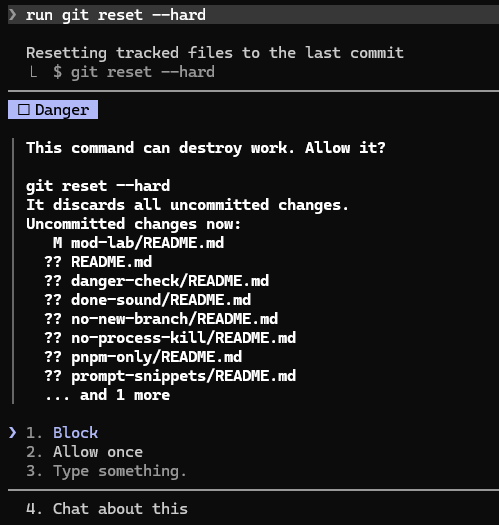
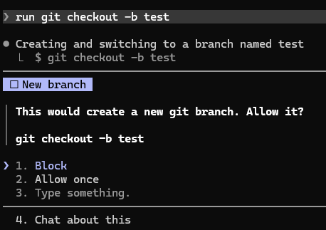
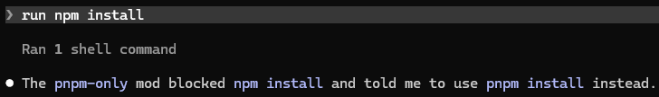
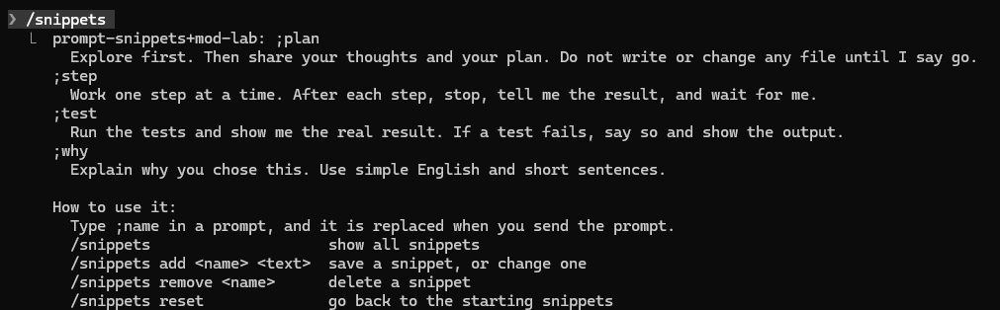
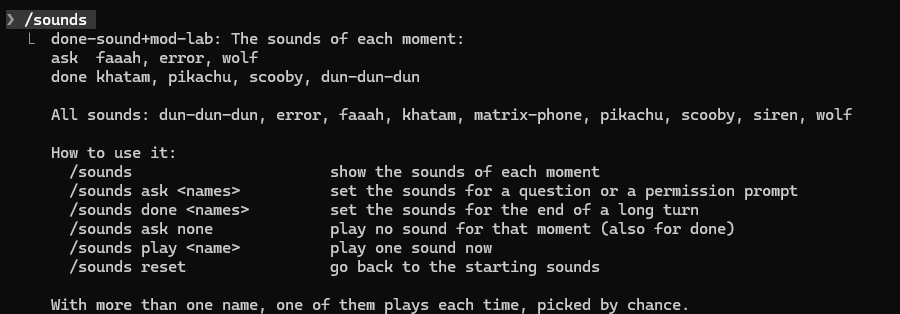
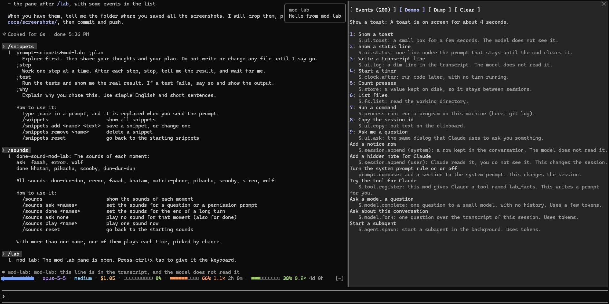

# cc-mods

These are the mods I wrote for my own use of [Claude Code](https://claude.com/claude-code).

A mod is a plugin that runs inside the Claude Code session. It can ask me before a command
runs, draw a line above the prompt, play a sound, or add a slash command.

I wrote each one to fix something in the way I work. So these are my personal notes, not a
product. Some mods may be useful to you. Some may not fit the way you work at all. Each mod
works alone, so take only what you like.


## The mods

| Mod | Why I have it |
| --- | --- |
| [usage-line](usage-line) | I want to see my cost, my context use, and my 5-hour and weekly limits all the time |
| [danger-check](danger-check) | I want to be asked before a command that can destroy my work, such as `rm -rf` or `git push --force` |
| [no-new-branch](no-new-branch) | I commit on the branch I am on, and I do not want Claude to create a new one without asking |
| [no-process-kill](no-process-kill) | I do not want Claude to stop a running process without asking |
| [pnpm-only](pnpm-only) | I use only `pnpm`, so `npm` and `npx` are blocked |
| [prompt-snippets](prompt-snippets) | I type the same instructions often, so `;plan` writes them for me |
| [done-sound](done-sound) | I look away during long turns, so a sound tells me when Claude is done or waits for me |
| [mod-lab](mod-lab) | I use it to learn what a mod can do, and to try the mod API |

## Will a mod be useful to you?

My honest guess:

- **Useful to most people**: `usage-line`, `danger-check`, `prompt-snippets`.
- **Only if you have the same rule as I do**: `pnpm-only`, `no-new-branch`, `no-process-kill`.
  If you use npm, or you like Claude to create branches, these will only be in your way.
- **A matter of taste**: `done-sound`. The sounds are the ones I find funny.
- **Only if you write mods**: `mod-lab`.

## Install

You need Claude Code. I tested the mods with version 2.1.289, on Windows.

First, add this repository as a marketplace (a list of plugins that Claude Code can install
from):

```
claude plugin marketplace add achapla/cc-mods
```

Then install the mods you want:

```
claude plugin install usage-line@cc-mods
claude plugin install danger-check@cc-mods
```

You can also do both steps inside a session, with `/plugin marketplace add achapla/cc-mods`
and `/plugin install usage-line@cc-mods`.

To install a mod for one project only, add `--scope project`:

```
claude plugin install mod-lab@cc-mods --scope project
```

To get new versions later:

```
claude plugin marketplace update cc-mods
```

The mod API of Claude Code is early access. It can change between releases, so a mod can stop
working after an update of Claude Code. I fix the mods when that happens to me, but I make no
promise.

## usage-line

One line above the prompt. It shows my account name, the model, the effort level, the cost of
the session, and a bar for the context window and for each limit window.

Each limit bar also shows a pace number. At `1.0×` I reach the limit exactly when the window
resets. Above that I am using the limit too fast, and the bar changes color.

I type `/usage-style` to choose how the bars are drawn.

[More about usage-line](usage-line)

## danger-check

Before a command that can destroy work runs, the mod stops and asks me. When it can, it also
shows what I would lose, for example the list of my uncommitted changes.



[More about danger-check](danger-check)

## no-new-branch

Asks me before Claude creates a git branch or a worktree. When I answer "Block", Claude is
told to continue on the current branch.



[More about no-new-branch](no-new-branch)

## no-process-kill

Asks me before Claude stops a running process, for example with `kill`, `taskkill` or
`Stop-Process`.


[More about no-process-kill](no-process-kill)

## pnpm-only

Blocks every `npm` and `npx` command and tells Claude the `pnpm` command to run instead. It
does not ask me, so the work continues without a stop.



[More about pnpm-only](pnpm-only)

## prompt-snippets

I type `;plan` in a prompt, and the mod replaces it with a longer text when I send the prompt.
With `/snippets` I see, add and remove my snippets.



[More about prompt-snippets](prompt-snippets)

## done-sound

Plays a sound in two moments: when a turn that took 10 seconds or more ends, and when Claude
waits for my answer. With `/sounds` I choose the sounds of each moment.



[More about done-sound](done-sound)

## mod-lab

A mod for learning. It shows the events that a mod can hook, writes a file with everything a
mod can read, and has demos that each run one small capability.



[More about mod-lab](mod-lab)

## Change a mod

If a mod almost fits you, change it. Clone the repository and add the folder as a marketplace:

```
git clone https://github.com/achapla/cc-mods.git
cd cc-mods
claude plugin marketplace add ./
claude plugin install usage-line@cc-mods
```

Each mod is one folder:

| Path | What it holds |
| --- | --- |
| `.claude-plugin/plugin.json` | The name, version and description of the mod |
| `hooks/hooks.json` | The name of the hooks module |
| `hooks/register.ts` | The hooks of the mod |
| `tests/` | The tests |

After I change the code, I run `/reload-plugins` in the session.

To check and test one mod, I run these from the `cc-mods` folder:

```
claude plugin validate usage-line
claude plugin test usage-line
```
