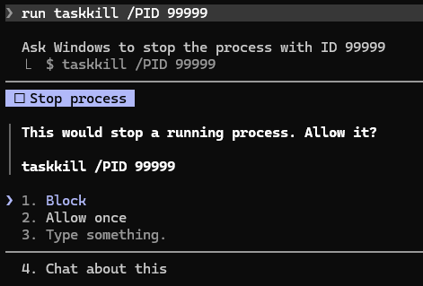

# no-process-kill

Asks me before any command that would stop a running process.



## Why I made it

I often have servers and other programs running that Claude did not start. When a port is
busy, Claude likes to stop the process that holds it. I want to decide that myself.

This one fits only if you have the same problem. If you let Claude manage your processes, it
will only be in your way.

## Install

```
claude plugin marketplace add achapla/cc-mods
claude plugin install no-process-kill@cc-mods
```

## How it works

When Claude is about to stop a process, a dialog shows the command and two answers:

- **Block**: the command does not run. Claude is told not to try another way to stop the
  process, and to ask me what to do next.
- **Allow once**: the command runs this one time.

When I close the dialog without an answer, the command is blocked.

## What it asks about

| Kind | Examples |
| --- | --- |
| Bash commands | `kill`, `pkill`, `killall`, `fkill`, `kill-port` |
| Windows commands | `taskkill`, `tskill`, `Stop-Process`, `wmic process ... delete` |
| .NET calls in PowerShell | `$process.Kill()` |
| Claude Code tools | The `TaskStop` tool, which stops a background task |

The mod also finds these commands when they are written after a wrapper such as `sudo`,
`xargs` or `npx`, or inside quoted text given to `bash -c` or `powershell -Command`.

It does not ask about `kill -0`, which only tests that a process exists, or `kill -l`, which
only lists signal names.

## Check and test

I run both from the `cc-mods` folder:

```
claude plugin validate no-process-kill
claude plugin test no-process-kill
```
